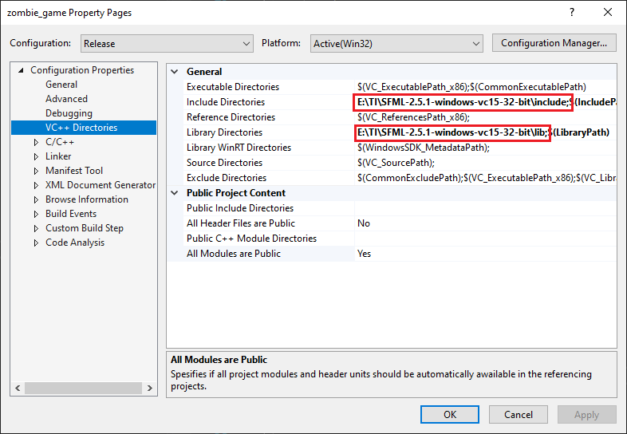

# Zombie Game

* [OneDrive](https://hogeschoolutrecht-my.sharepoint.com/:f:/g/personal/nicky_hagens_student_hu_nl/EgIDR-gCgPxHq1xc9gh8vXoBJUYMzyNiaNs0RPFJYWlhXQ?e=5%3aFbrEwN&at=9)
* [Trello](https://trello.com/b/tcpV4Zjo/v2thga-2020)

## Dependencies

* [SFML-2.5.1 Visual C++ 15 (2017) - 32-bit](https://www.sfml-dev.org/files/SFML-2.5.1-windows-vc15-32-bit.zip)

zombie_game->Properties->VC++ Directories



After changing your include and lib directories run:
```git update-index --assume-unchanged zombie_game/zombie_game.vcxproj```
to ignore any changes made to the vcxproj file
